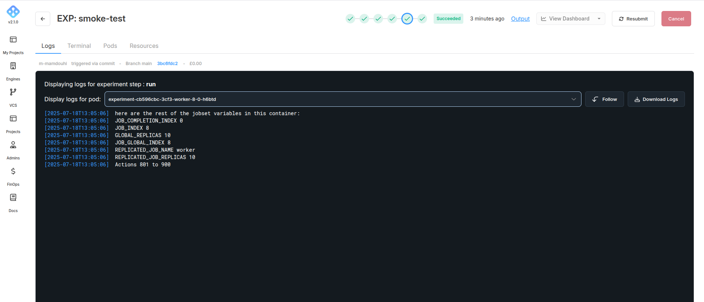

By controling the number of workers you can decide how your job will be divided, for example you can have 1000 different actions that pretty much take the same amount of resources and you don't really need any specific sort of distribution so you can set up 10 workers all with equal loads like this:

```
worker 0: 1   ->  100
worker 1: 101 ->  200
worker 2: 201 ->  300
...
worker 9: 901 -> 1000
```

This would be very similar to the simple case:

```yaml
kind: AIchorManifest
apiVersion: 0.2.1

builder:
  image: jobset-multi-jobs
  dockerfile: ./Dockerfile
  context: .

spec:
  operator: jobset
  image: jobset-multi-jobs
  command: "python -u src/main.10-1-1.py"

  types:
    worker:
      count: 10
      resources:
        cpus: 20
        ramRatio: 2
        shmSizeGB: 0
```
and then the following in the code:

```python
import os
import time
import random

def jobsetop():
    job_completion_index = os.environ.get("JOB_COMPLETION_INDEX")
    job_index = os.environ.get("JOB_INDEX")
    global_replicas = os.environ.get("GLOBAL_REPLICAS")
    job_global_index = os.environ.get("JOB_GLOBAL_INDEX")
    replicated_job_name = os.environ.get("REPLICATED_JOB_NAME")
    replicated_job_replicas = os.environ.get("REPLICATED_JOB_REPLICAS")

    print("JOB_COMPLETION_INDEX ", job_completion_index)
    print("JOB_INDEX ", job_index)
    print("GLOBAL_REPLICAS ", global_replicas)
    print("JOB_GLOBAL_INDEX ", job_global_index)
    print("REPLICATED_JOB_NAME ", replicated_job_name)
    print("REPLICATED_JOB_REPLICAS ", replicated_job_replicas)

def get_rank() -> int:
    jobset_global_index = os.environ.get("JOB_GLOBAL_INDEX") # here JOB_INDEX could also be used in this scenario
    if jobset_global_index == None:
        return 0
    return int(jobset_global_index)


# Now we can use the ranks to define different tasks
if __name__ == '__main__':

    print(f"here are the rest of the jobset variables in this container:")
    jobsetop()

    rank = get_rank()

    start = rank * 100 + 1
    end = start + 99
    print(f"Actions {start} to {end}")
    time.sleep(random.randint(10, 60))
```
Below you can see the pods succeeded on AIchor:


and now the logs of a few of the pods

worker-2-0:


worker-8-0:


